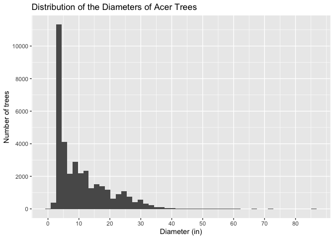
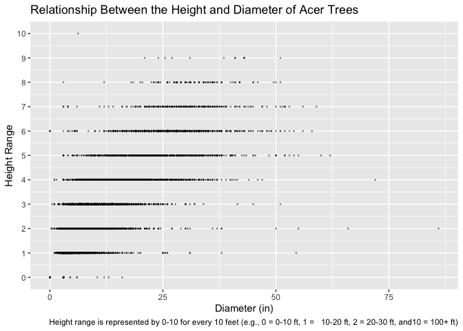
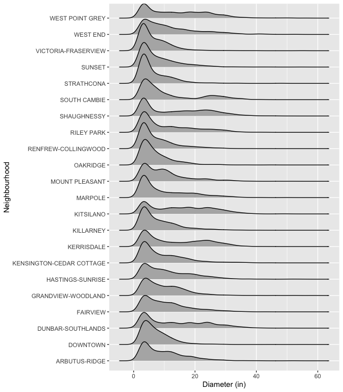

Mini Data-Analysis Deliverable 1
================

# Welcome to your (maybe) first-ever data analysis project!

And hopefully the first of many. Let’s get started:

1.  Install the [`datateachr`](https://github.com/UBC-MDS/datateachr)
    package by typing the following into your **R terminal**:

<!-- -->

    install.packages("devtools")
    devtools::install_github("UBC-MDS/datateachr")

2.  Load the packages below.

``` r
library(datateachr)
library(tidyverse)
```

    ## ── Attaching core tidyverse packages ──────────────────────── tidyverse 2.0.0 ──
    ## ✔ dplyr     1.1.3     ✔ readr     2.1.4
    ## ✔ forcats   1.0.0     ✔ stringr   1.5.0
    ## ✔ ggplot2   3.4.3     ✔ tibble    3.2.1
    ## ✔ lubridate 1.9.2     ✔ tidyr     1.3.0
    ## ✔ purrr     1.0.2     
    ## ── Conflicts ────────────────────────────────────────── tidyverse_conflicts() ──
    ## ✖ dplyr::filter() masks stats::filter()
    ## ✖ dplyr::lag()    masks stats::lag()
    ## ℹ Use the conflicted package (<http://conflicted.r-lib.org/>) to force all conflicts to become errors

3.  Make a repository in the <https://github.com/stat545ubc-2023>
    Organization. You can do this by following the steps found on canvas
    in the entry called [MDA: Create a
    repository](https://canvas.ubc.ca/courses/126199/pages/mda-create-a-repository).
    One completed, your repository should automatically be listed as
    part of the stat545ubc-2023 Organization.

# Instructions

## For Both Milestones

- Each milestone has explicit tasks. Tasks that are more challenging
  will often be allocated more points.

- Each milestone will be also graded for reproducibility, cleanliness,
  and coherence of the overall Github submission.

- While the two milestones will be submitted as independent
  deliverables, the analysis itself is a continuum - think of it as two
  chapters to a story. Each chapter, or in this case, portion of your
  analysis, should be easily followed through by someone unfamiliar with
  the content.
  [Here](https://swcarpentry.github.io/r-novice-inflammation/06-best-practices-R/)
  is a good resource for what constitutes “good code”. Learning good
  coding practices early in your career will save you hassle later on!

- The milestones will be equally weighted.

## For Milestone 1

**To complete this milestone**, edit [this very `.Rmd`
file](https://raw.githubusercontent.com/UBC-STAT/stat545.stat.ubc.ca/master/content/mini-project/mini-project-1.Rmd)
directly. Fill in the sections that are tagged with
`<!--- start your work below --->`.

**To submit this milestone**, make sure to knit this `.Rmd` file to an
`.md` file by changing the YAML output settings from
`output: html_document` to `output: github_document`. Commit and push
all of your work to the mini-analysis GitHub repository you made
earlier, and tag a release on GitHub. Then, submit a link to your tagged
release on canvas.

**Points**: This milestone is worth 36 points: 30 for your analysis, and
6 for overall reproducibility, cleanliness, and coherence of the Github
submission.

# Learning Objectives

By the end of this milestone, you should:

- Become familiar with your dataset of choosing
- Select 4 questions that you would like to answer with your data
- Generate a reproducible and clear report using R Markdown
- Become familiar with manipulating and summarizing your data in tibbles
  using `dplyr`, with a research question in mind.

# Task 1: Choose your favorite dataset

The `datateachr` package by Hayley Boyce and Jordan Bourak currently
composed of 7 semi-tidy datasets for educational purposes. Here is a
brief description of each dataset:

- *apt_buildings*: Acquired courtesy of The City of Toronto’s Open Data
  Portal. It currently has 3455 rows and 37 columns.

- *building_permits*: Acquired courtesy of The City of Vancouver’s Open
  Data Portal. It currently has 20680 rows and 14 columns.

- *cancer_sample*: Acquired courtesy of UCI Machine Learning Repository.
  It currently has 569 rows and 32 columns.

- *flow_sample*: Acquired courtesy of The Government of Canada’s
  Historical Hydrometric Database. It currently has 218 rows and 7
  columns.

- *parking_meters*: Acquired courtesy of The City of Vancouver’s Open
  Data Portal. It currently has 10032 rows and 22 columns.

- *steam_games*: Acquired courtesy of Kaggle. It currently has 40833
  rows and 21 columns.

- *vancouver_trees*: Acquired courtesy of The City of Vancouver’s Open
  Data Portal. It currently has 146611 rows and 20 columns.

**Things to keep in mind**

- We hope that this project will serve as practice for carrying our your
  own *independent* data analysis. Remember to comment your code, be
  explicit about what you are doing, and write notes in this markdown
  document when you feel that context is required. As you advance in the
  project, prompts and hints to do this will be diminished - it’ll be up
  to you!

- Before choosing a dataset, you should always keep in mind **your
  goal**, or in other ways, *what you wish to achieve with this data*.
  This mini data-analysis project focuses on *data wrangling*,
  *tidying*, and *visualization*. In short, it’s a way for you to get
  your feet wet with exploring data on your own.

And that is exactly the first thing that you will do!

1.1 **(1 point)** Out of the 7 datasets available in the `datateachr`
package, choose **4** that appeal to you based on their description.
Write your choices below:

**Note**: We encourage you to use the ones in the `datateachr` package,
but if you have a dataset that you’d really like to use, you can include
it here. But, please check with a member of the teaching team to see
whether the dataset is of appropriate complexity. Also, include a
**brief** description of the dataset here to help the teaching team
understand your data.

<!-------------------------- Start your work below ---------------------------->

1: vancouver_trees 2: steam_games 3: parking_meters 4: apt_buildings

<!----------------------------------------------------------------------------->

1.2 **(6 points)** One way to narrowing down your selection is to
*explore* the datasets. Use your knowledge of dplyr to find out at least
*3* attributes about each of these datasets (an attribute is something
such as number of rows, variables, class type…). The goal here is to
have an idea of *what the data looks like*.

*Hint:* This is one of those times when you should think about the
cleanliness of your analysis. I added a single code chunk for you below,
but do you want to use more than one? Would you like to write more
comments outside of the code chunk?

<!-------------------------- Start your work below ---------------------------->

### Dataset 1

#### Exploring vancouver_trees

``` r
### EXPLORING vancouver_trees ###

tree_names <- names(vancouver_trees) # gives the column names of the data set vancouver_trees
print(tree_names)
```

    ##  [1] "tree_id"            "civic_number"       "std_street"        
    ##  [4] "genus_name"         "species_name"       "cultivar_name"     
    ##  [7] "common_name"        "assigned"           "root_barrier"      
    ## [10] "plant_area"         "on_street_block"    "on_street"         
    ## [13] "neighbourhood_name" "street_side_name"   "height_range_id"   
    ## [16] "diameter"           "curb"               "date_planted"      
    ## [19] "longitude"          "latitude"

``` r
tree_rows <- vancouver_trees %>%
  summarise(n = n()) # gives the number of rows in the data set vancouver_trees
print(tree_rows)
```

    ## # A tibble: 1 × 1
    ##        n
    ##    <int>
    ## 1 146611

``` r
tree_number_genus <- count(vancouver_trees, genus_name) # gives the number of trees for each species of tree in the data set vancouver_trees
print(tree_number_genus)
```

    ## # A tibble: 97 × 2
    ##    genus_name      n
    ##    <chr>       <int>
    ##  1 ABIES         190
    ##  2 ACER        36062
    ##  3 AESCULUS     2570
    ##  4 AILANTHUS       4
    ##  5 ALBIZIA         1
    ##  6 ALNUS          74
    ##  7 AMELANCHIER   226
    ##  8 ARALIA          4
    ##  9 ARAUCARIA      10
    ## 10 ARBUTUS        10
    ## # ℹ 87 more rows

### Dataset 2

#### Exploring steam_games

``` r
### EXPLORING steam_games ###

games_names <- names(steam_games) # gives the column names of the data set vancouver_trees
print(games_names)
```

    ##  [1] "id"                       "url"                     
    ##  [3] "types"                    "name"                    
    ##  [5] "desc_snippet"             "recent_reviews"          
    ##  [7] "all_reviews"              "release_date"            
    ##  [9] "developer"                "publisher"               
    ## [11] "popular_tags"             "game_details"            
    ## [13] "languages"                "achievements"            
    ## [15] "genre"                    "game_description"        
    ## [17] "mature_content"           "minimum_requirements"    
    ## [19] "recommended_requirements" "original_price"          
    ## [21] "discount_price"

``` r
games_rows <- steam_games %>%
  summarise(n = n()) # gives how many games are in the data set steam_games
print(games_rows)
```

    ## # A tibble: 1 × 1
    ##       n
    ##   <int>
    ## 1 40833

``` r
games_count <- count(steam_games, genre) # gives the number of games for each genre of game from the data set steam_games
print(games_count)
```

    ## # A tibble: 1,769 × 2
    ##    genre                                                                       n
    ##    <chr>                                                                   <int>
    ##  1 Accounting                                                                  2
    ##  2 Accounting,Animation & Modeling,Audio Production,Design & Illustration…     1
    ##  3 Accounting,Animation & Modeling,Audio Production,Design & Illustration…     2
    ##  4 Accounting,Education,Software Training,Utilities,Early Access               1
    ##  5 Action                                                                   2386
    ##  6 Action,Adventure                                                          809
    ##  7 Action,Adventure,Casual                                                    64
    ##  8 Action,Adventure,Casual,Early Access                                        1
    ##  9 Action,Adventure,Casual,Free to Play                                        1
    ## 10 Action,Adventure,Casual,Free to Play,Early Access                           1
    ## # ℹ 1,759 more rows

### Dataset 3

#### Exploring parking_meters

``` r
### EXPLORING parking_meters ###

meters_names <- names(parking_meters) # gives the column names of the data set parking_meters
print(meters_names)
```

    ##  [1] "meter_head"     "r_mf_9a_6p"     "r_mf_6p_10"     "r_sa_9a_6p"    
    ##  [5] "r_sa_6p_10"     "r_su_9a_6p"     "r_su_6p_10"     "rate_misc"     
    ##  [9] "time_in_effect" "t_mf_9a_6p"     "t_mf_6p_10"     "t_sa_9a_6p"    
    ## [13] "t_sa_6p_10"     "t_su_9a_6p"     "t_su_6p_10"     "time_misc"     
    ## [17] "credit_card"    "pay_phone"      "longitude"      "latitude"      
    ## [21] "geo_local_area" "meter_id"

``` r
meters_rows <- parking_meters %>%
  summarise(n = n()) # gives how many parking meters are in the data set parking_meters
print(meters_rows)
```

    ## # A tibble: 1 × 1
    ##       n
    ##   <int>
    ## 1 10032

``` r
meters_numbers_geo <- count(parking_meters, geo_local_area) # gives the number of parking meters for each geographical location in the data set vancouver_trees
print(meters_numbers_geo)
```

    ## # A tibble: 18 × 2
    ##    geo_local_area               n
    ##    <chr>                    <int>
    ##  1 Arbutus-Ridge              148
    ##  2 Downtown                  3771
    ##  3 Fairview                  1624
    ##  4 Grandview-Woodland         312
    ##  5 Hastings-Sunrise             7
    ##  6 Kensington-Cedar Cottage    50
    ##  7 Kerrisdale                 139
    ##  8 Killarney                   32
    ##  9 Kitsilano                  920
    ## 10 Mount Pleasant             898
    ## 11 Renfrew-Collingwood         43
    ## 12 Riley Park                 280
    ## 13 Shaughnessy                 15
    ## 14 South Cambie                91
    ## 15 Strathcona                 508
    ## 16 Sunset                      77
    ## 17 West End                   940
    ## 18 West Point Grey            177

### Dataset 4

#### Exploring apt_buildings

``` r
### EXPLORING apt_buildings ###

buildings_names <- names(apt_buildings) # gives the column names of the data set apt_buildings
print(buildings_names)
```

    ##  [1] "id"                               "air_conditioning"                
    ##  [3] "amenities"                        "balconies"                       
    ##  [5] "barrier_free_accessibilty_entr"   "bike_parking"                    
    ##  [7] "exterior_fire_escape"             "fire_alarm"                      
    ##  [9] "garbage_chutes"                   "heating_type"                    
    ## [11] "intercom"                         "laundry_room"                    
    ## [13] "locker_or_storage_room"           "no_of_elevators"                 
    ## [15] "parking_type"                     "pets_allowed"                    
    ## [17] "prop_management_company_name"     "property_type"                   
    ## [19] "rsn"                              "separate_gas_meters"             
    ## [21] "separate_hydro_meters"            "separate_water_meters"           
    ## [23] "site_address"                     "sprinkler_system"                
    ## [25] "visitor_parking"                  "ward"                            
    ## [27] "window_type"                      "year_built"                      
    ## [29] "year_registered"                  "no_of_storeys"                   
    ## [31] "emergency_power"                  "non-smoking_building"            
    ## [33] "no_of_units"                      "no_of_accessible_parking_spaces" 
    ## [35] "facilities_available"             "cooling_room"                    
    ## [37] "no_barrier_free_accessible_units"

``` r
buildings_rows <- apt_buildings %>%
  summarise(n = n()) # gives how many apartment buildings are in the data set apt_buildings
print(buildings_rows)
```

    ## # A tibble: 1 × 1
    ##       n
    ##   <int>
    ## 1  3455

``` r
buildings_heating_year <- count(apt_buildings, heating_type, year_built) # gives insight into the number of apartment buildings that use different heating types and the year they were built in within the data set apt_buildings
print(buildings_heating_year)
```

    ## # A tibble: 296 × 3
    ##    heating_type year_built     n
    ##    <chr>             <dbl> <int>
    ##  1 ELECTRIC           1838     1
    ##  2 ELECTRIC           1885     1
    ##  3 ELECTRIC           1897     1
    ##  4 ELECTRIC           1900     3
    ##  5 ELECTRIC           1901     1
    ##  6 ELECTRIC           1910     3
    ##  7 ELECTRIC           1911     2
    ##  8 ELECTRIC           1912     2
    ##  9 ELECTRIC           1913     1
    ## 10 ELECTRIC           1917     1
    ## # ℹ 286 more rows

<!----------------------------------------------------------------------------->

1.3 **(1 point)** Now that you’ve explored the 4 datasets that you were
initially most interested in, let’s narrow it down to 1. What lead you
to choose this one? Briefly explain your choice below.

<!-------------------------- Start your work below ---------------------------->

After exploring the 4 datasets that I was most interested in, I have
decided to work on the *vancouver_trees* dataset. I believe that this
dataset will allow for many interesting statistical comparisons of
different variables. For example, it would be interesting to compare
what genus of trees are most commonly planted on different streets. It
would also be interesting to compare tree heights and diameters to date
planted within and across genera. This analysis could also incorporate
longitude and latitude to see if this has any affect on tree size.
<!----------------------------------------------------------------------------->

1.4 **(2 points)** Time for a final decision! Going back to the
beginning, it’s important to have an *end goal* in mind. For example, if
I had chosen the `titanic` dataset for my project, I might’ve wanted to
explore the relationship between survival and other variables. Try to
think of 1 research question that you would want to answer with your
dataset. Note it down below.

<!-------------------------- Start your work below ---------------------------->

My research question is: Can we identify a relationship between
Vancouver tree size (height and diameter) and different neighbourhoods
for trees of the Acer genus? If such a relationship exists, can we
quantify the effects of the different neighbourhoods on the height and
diameter of Acer trees?
<!----------------------------------------------------------------------------->

# Important note

Read Tasks 2 and 3 *fully* before starting to complete either of them.
Probably also a good point to grab a coffee to get ready for the fun
part!

This project is semi-guided, but meant to be *independent*. For this
reason, you will complete tasks 2 and 3 below (under the **START HERE**
mark) as if you were writing your own exploratory data analysis report,
and this guidance never existed! Feel free to add a brief introduction
section to your project, format the document with markdown syntax as you
deem appropriate, and structure the analysis as you deem appropriate. If
you feel lost, you can find a sample data analysis
[here](https://www.kaggle.com/headsortails/tidy-titarnic) to have a
better idea. However, bear in mind that it is **just an example** and
you will not be required to have that level of complexity in your
project.

# Task 2: Exploring your dataset

If we rewind and go back to the learning objectives, you’ll see that by
the end of this deliverable, you should have formulated *4* research
questions about your data that you may want to answer during your
project. However, it may be handy to do some more exploration on your
dataset of choice before creating these questions - by looking at the
data, you may get more ideas. **Before you start this task, read all
instructions carefully until you reach START HERE under Task 3**.

2.1 **(12 points)** Complete *4 out of the following 8 exercises* to
dive deeper into your data. All datasets are different and therefore,
not all of these tasks may make sense for your data - which is why you
should only answer *4*.

Make sure that you’re using dplyr and ggplot2 rather than base R for
this task. Outside of this project, you may find that you prefer using
base R functions for certain tasks, and that’s just fine! But part of
this project is for you to practice the tools we learned in class, which
is dplyr and ggplot2.

1.  Plot the distribution of a numeric variable.
2.  Create a new variable based on other variables in your data (only if
    it makes sense)
3.  Investigate how many missing values there are per variable. Can you
    find a way to plot this?
4.  Explore the relationship between 2 variables in a plot.
5.  Filter observations in your data according to your own criteria.
    Think of what you’d like to explore - again, if this was the
    `titanic` dataset, I may want to narrow my search down to passengers
    born in a particular year…
6.  Use a boxplot to look at the frequency of different observations
    within a single variable. You can do this for more than one variable
    if you wish!
7.  Make a new tibble with a subset of your data, with variables and
    observations that you are interested in exploring.
8.  Use a density plot to explore any of your variables (that are
    suitable for this type of plot).

### 1) Filtering Observations

#### Exercise 5

``` r
acer_trees <- filter(vancouver_trees, genus_name == "ACER") # filter for trees only of the Acer genus in the dataset vancouver_trees and assign it to acer_trees
```

**Explanation:** I filtered the vancouver_trees observations by genus of
tree. Specifically, I filtered for only trees of the “Acer” genus as my
research question in 1.4 specifically looks at Acer trees. Additionally,
this narrows down the amount of data to be more manageable. It also
standardizes for a specific genus of tree, rather than comparing all
species of trees.

### 2) Plotting the Distribution of a Numeric Variable

#### Exercise 1

``` r
tree_distribution <- acer_trees %>%
  filter(diameter < 100) %>%  # filter for trees with diameters less than 100
  group_by(diameter) %>%
  ggplot(aes(x = diameter)) +
  geom_histogram(bins = 50) + # creates histogram and 50 different groups to define the histogram
  labs(x = "Diameter (in)", y = "Number of trees",
       title = "Distribution of the Diameters of Acer Trees") +
  scale_x_continuous(breaks = seq(0, 80, by = 10)) + # setting the scale of the x axis
  scale_y_continuous(breaks = seq(0, 14000, by = 2000)) # setting the scale of the y axis

print(tree_distribution)
```

<!-- -->

**Explanation:** In this histogram, I chose to plot the distribution of
diameters of Acer trees. I was interested in which diameters were most
common among Acer trees. Additionally, I wanted to see the distribution
of trees that were on the wider side. I filtered for diameters less than
100 inches due to extreme outliers that were altering the shape of the
histogram and making it harder to read. Specifically, there were five
trees that were much wider than the majority.

### 3) Exploring the Relationship Between 2 Variables

#### Exercise 4

``` r
diam_vs_height <- acer_trees %>%
  filter(diameter < 100) %>%  # filter for trees with diameters less than 100
  ggplot(aes(x = diameter, y = height_range_id)) +
  geom_point(size = 0.2, alpha = 0.4) + # creates scatterplot, sets point size and transparency
  labs(x = "Diameter (in)", y = "Height Range",
       title = "Relationship Between the Height and Diameter of Acer Trees",
       caption = "Height range is represented by 0-10 for every 10 feet (e.g., 0 = 0-10 ft, 1 =   10-20 ft, 2 = 20-30 ft, and10 = 100+ ft)") +
  scale_y_continuous(breaks = seq(0, 10, by = 1)) # setting the scale of the y axis

print(diam_vs_height)
```

<!-- -->

**Explanation:** This plot explores the relationship between the
diameter of a tree and its height. I chose to plot these two variables
as I wanted to assess whether trees with a larger diameter would also be
taller on average. Again, I filtered for trees with diameters less than
100 inches to remove extreme outliers from the scatterplot.

### 4) Making a Density Plot

#### Exercise 8

``` r
tree_diam_density <- acer_trees %>% 
  filter(diameter < 60) %>% # filter for trees with diameters less than 60
  ggplot(aes(x = diameter, y = neighbourhood_name)) +
  ggridges::geom_density_ridges() + # creates the density plot
  labs(x = "Diameter (in)", y = "Neighbourhood")

print(tree_diam_density)
```

    ## Picking joint bandwidth of 1.53

<!-- -->

**Explanation:** Here, I made a density plot of the diameters of Acer
trees based on which neighbourhood they reside in. I was interested in
seeing whether different neighbourhoods may have more trees of larger or
smaller diameters. A density plot was ideal to visualize this as it
shows the diameters of trees between neighbourhoods on a continuous
scale. For example, it is evident that neighbourhoods such as West Point
Grey or Kitsilano contain more trees of a larger diameter. I filtered
for trees with a diameter less than 60 inches to exclude outliers and to
make the plot more readable.

2.2 **(4 points)** For each of the 4 exercises that you complete,
provide a *brief explanation* of why you chose that exercise in relation
to your data (in other words, why does it make sense to do that?), and
sufficient comments for a reader to understand your reasoning and code.

<!-------------------------- Start your work below ---------------------------->

*Note that I wrote my brief explanations below the output for each
exercise code as I believe this method is more organized. My comments
can also be found within the code.*
<!----------------------------------------------------------------------------->

# Task 3: Choose research questions

**(4 points)** So far, you have chosen a dataset and gotten familiar
with it through exploring the data. You have also brainstormed one
research question that interested you (Task 1.4). Now it’s time to pick
4 research questions that you would like to explore in Milestone 2!
Write the 4 questions and any additional comments below.

<!--- *****START HERE***** --->

### Research Question 1

Within a genus of Vancouver trees, does the average diameter and height
of a tree differ between species? Do these variables differ between
genera?

### Research Question 2

Are the different genera of trees spread uniformly across Vancouver or
do certain genera of trees cluster within certain parts of Vancouver,
such as by neighbourhoods?

### Research Question 3

Can we detect a difference in the average age of trees in different
neighbourhoods of Vancouver? Does this correspond to the age of the
neighbourhood?

### Research Question 4

In Vancouver, how often are trees planted in the presence of a curb?
Does the presence of a curb next to where a tree is growing affect its
diameter and height? <!----------------------------->

# Overall reproducibility/Cleanliness/Coherence Checklist

## Coherence (0.5 points)

The document should read sensibly from top to bottom, with no major
continuity errors. An example of a major continuity error is having a
data set listed for Task 3 that is not part of one of the data sets
listed in Task 1.

## Error-free code (3 points)

For full marks, all code in the document should run without error. 1
point deduction if most code runs without error, and 2 points deduction
if more than 50% of the code throws an error.

## Main README (1 point)

There should be a file named `README.md` at the top level of your
repository. Its contents should automatically appear when you visit the
repository on GitHub.

Minimum contents of the README file:

- In a sentence or two, explains what this repository is, so that
  future-you or someone else stumbling on your repository can be
  oriented to the repository.
- In a sentence or two (or more??), briefly explains how to engage with
  the repository. You can assume the person reading knows the material
  from STAT 545A. Basically, if a visitor to your repository wants to
  explore your project, what should they know?

Once you get in the habit of making README files, and seeing more README
files in other projects, you’ll wonder how you ever got by without them!
They are tremendously helpful.

## Output (1 point)

All output is readable, recent and relevant:

- All Rmd files have been `knit`ted to their output md files.
- All knitted md files are viewable without errors on Github. Examples
  of errors: Missing plots, “Sorry about that, but we can’t show files
  that are this big right now” messages, error messages from broken R
  code
- All of these output files are up-to-date – that is, they haven’t
  fallen behind after the source (Rmd) files have been updated.
- There should be no relic output files. For example, if you were
  knitting an Rmd to html, but then changed the output to be only a
  markdown file, then the html file is a relic and should be deleted.

(0.5 point deduction if any of the above criteria are not met. 1 point
deduction if most or all of the above criteria are not met.)

Our recommendation: right before submission, delete all output files,
and re-knit each milestone’s Rmd file, so that everything is up to date
and relevant. Then, after your final commit and push to Github, CHECK on
Github to make sure that everything looks the way you intended!

## Tagged release (0.5 points)

You’ve tagged a release for Milestone 1.

### Attribution

Thanks to Icíar Fernández Boyano for mostly putting this together, and
Vincenzo Coia for launching.
