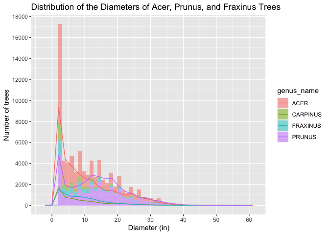
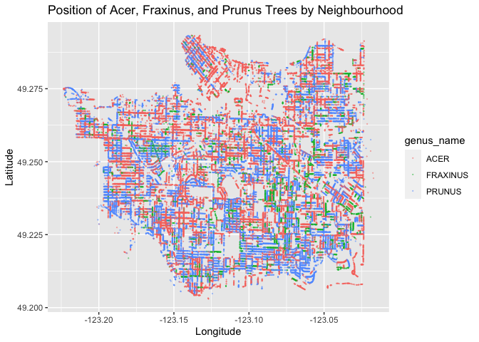
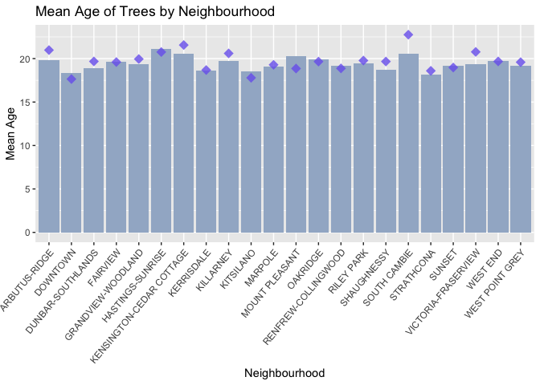
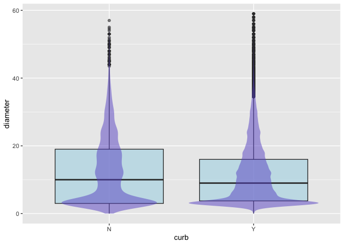

*To complete this milestone, you can either edit [this `.rmd`
file](https://raw.githubusercontent.com/UBC-STAT/stat545.stat.ubc.ca/master/content/mini-project/mini-project-2.Rmd)
directly. Fill in the sections that are commented out with
`<!--- start your work here--->`. When you are done, make sure to knit
to an `.md` file by changing the output in the YAML header to
`github_document`, before submitting a tagged release on canvas.*

# Welcome to the rest of your mini data analysis project!

In Milestone 1, you explored your data. and came up with research
questions. This time, we will finish up our mini data analysis and
obtain results for your data by:

-   Making summary tables and graphs
-   Manipulating special data types in R: factors and/or dates and
    times.
-   Fitting a model object to your data, and extract a result.
-   Reading and writing data as separate files.

We will also explore more in depth the concept of *tidy data.*

**NOTE**: The main purpose of the mini data analysis is to integrate
what you learn in class in an analysis. Although each milestone provides
a framework for you to conduct your analysis, it’s possible that you
might find the instructions too rigid for your data set. If this is the
case, you may deviate from the instructions – just make sure you’re
demonstrating a wide range of tools and techniques taught in this class.

# Instructions

**To complete this milestone**, edit [this very `.Rmd`
file](https://raw.githubusercontent.com/UBC-STAT/stat545.stat.ubc.ca/master/content/mini-project/mini-project-2.Rmd)
directly. Fill in the sections that are tagged with
`<!--- start your work here--->`.

**To submit this milestone**, make sure to knit this `.Rmd` file to an
`.md` file by changing the YAML output settings from
`output: html_document` to `output: github_document`. Commit and push
all of your work to your mini-analysis GitHub repository, and tag a
release on GitHub. Then, submit a link to your tagged release on canvas.

**Points**: This milestone is worth 50 points: 45 for your analysis, and
5 for overall reproducibility, cleanliness, and coherence of the Github
submission.

**Research Questions**: In Milestone 1, you chose two research questions
to focus on. Wherever realistic, your work in this milestone should
relate to these research questions whenever we ask for justification
behind your work. In the case that some tasks in this milestone don’t
align well with one of your research questions, feel free to discuss
your results in the context of a different research question.

# Learning Objectives

By the end of this milestone, you should:

-   Understand what *tidy* data is, and how to create it using `tidyr`.
-   Generate a reproducible and clear report using R Markdown.
-   Manipulating special data types in R: factors and/or dates and
    times.
-   Fitting a model object to your data, and extract a result.
-   Reading and writing data as separate files.

# Setup

Begin by loading your data and the tidyverse package below:

    library(datateachr) # <- might contain the data you picked!
    library(tidyverse)

# Task 1: Process and summarize your data

From milestone 1, you should have an idea of the basic structure of your
dataset (e.g. number of rows and columns, class types, etc.). Here, we
will start investigating your data more in-depth using various data
manipulation functions.

### 1.1 (1 point)

First, write out the 4 research questions you defined in milestone 1
were. This will guide your work through milestone 2:

<!-------------------------- Start your work below ---------------------------->

1.  Within a genus of Vancouver trees, does the average diameter and
    height of a tree differ between species? Do these variables differ
    between genera?
2.  Are the different genera of trees spread uniformly across Vancouver
    or do certain genera of trees cluster within certain parts of
    Vancouver, such as by neighbourhoods?
3.  Can we detect a difference in the average age of trees in different
    neighbourhoods of Vancouver? Does this correspond to the age of the
    neighbourhood?
4.  In Vancouver, how often are trees planted in the presence of a curb?
    Does the presence of a curb next to where a tree is growing affect
    its diameter and height?
    <!----------------------------------------------------------------------------->

Here, we will investigate your data using various data manipulation and
graphing functions.

### 1.2 (8 points)

Now, for each of your four research questions, choose one task from
options 1-4 (summarizing), and one other task from 4-8 (graphing). You
should have 2 tasks done for each research question (8 total). Make sure
it makes sense to do them! (e.g. don’t use a numerical variables for a
task that needs a categorical variable.). Comment on why each task helps
(or doesn’t!) answer the corresponding research question.

Ensure that the output of each operation is printed!

Also make sure that you’re using dplyr and ggplot2 rather than base R.
Outside of this project, you may find that you prefer using base R
functions for certain tasks, and that’s just fine! But part of this
project is for you to practice the tools we learned in class, which is
dplyr and ggplot2.

**Summarizing:**

1.  Compute the *range*, *mean*, and *two other summary statistics* of
    **one numerical variable** across the groups of **one categorical
    variable** from your data.
2.  Compute the number of observations for at least one of your
    categorical variables. Do not use the function `table()`!
3.  Create a categorical variable with 3 or more groups from an existing
    numerical variable. You can use this new variable in the other
    tasks! *An example: age in years into “child, teen, adult, senior”.*
4.  Compute the proportion and counts in each category of one
    categorical variable across the groups of another categorical
    variable from your data. Do not use the function `table()`!

**Graphing:**

1.  Create a graph of your choosing, make one of the axes logarithmic,
    and format the axes labels so that they are “pretty” or easier to
    read.
2.  Make a graph where it makes sense to customize the alpha
    transparency.

Using variables and/or tables you made in one of the “Summarizing”
tasks:

1.  Create a graph that has at least two geom layers.
2.  Create 3 histograms, with each histogram having different sized
    bins. Pick the “best” one and explain why it is the best.

Make sure it’s clear what research question you are doing each operation
for!

<!------------------------- Start your work below ----------------------------->

### Research Question 1

#### Summarizing

    four_trees <- vancouver_trees %>%
      filter(genus_name %in% c("ACER", "PRUNUS", "FRAXINUS", "CARPINUS")) # filtering for trees of these four genera

    four_trees_summary <- four_trees %>%
      group_by(genus_name) %>%
      summarize(range = max(diameter) - min(diameter), # calculating range of the diameters
                mean = mean(diameter),
                median = median(diameter),
                variance = var(diameter)) 

    print(four_trees_summary)

    ## # A tibble: 4 × 5
    ##   genus_name range  mean median variance
    ##   <chr>      <dbl> <dbl>  <dbl>    <dbl>
    ## 1 ACER       317   10.6     8       76.8
    ## 2 CARPINUS    86    9.33    6.5     58.6
    ## 3 FRAXINUS    97.5  9.51    8       46.0
    ## 4 PRUNUS     141   13.9    13       75.0

#### Graphing

    acer_prunus_distribution <- vancouver_trees %>%
      filter(genus_name %in% c("ACER", "PRUNUS", "FRAXINUS", "CARPINUS")) %>%
      filter(diameter < 60) %>%  # filter for trees with diameters less than 80
      group_by(diameter) %>%
      ggplot(aes(x = diameter, fill = genus_name)) +
      geom_histogram(bins = 50, alpha = 0.5) + # creates histogram and 50 different groups to define the histogram
      geom_freqpoly(aes(color = genus_name), alpha = 0.9) + # adds line graph for tree diameters
      labs(x = "Diameter (in)", y = "Number of trees",
           title = "Distribution of the Diameters of Acer, Prunus, and Fraxinus Trees") +
      scale_x_continuous(breaks = seq(0, 60, by = 10)) + # setting the scale of the x axis
      scale_y_continuous(breaks = seq(0, 18000, by = 2000)) # setting the scale of the y axis

    print(acer_prunus_distribution)

    ## `stat_bin()` using `bins = 30`. Pick better value with `binwidth`.

### Research Question 2

#### Summarizing

    genus_neighbourhood <- vancouver_trees %>%
      group_by(genus_name, neighbourhood_name) %>% # groups data by tree genus and neighbourhood
      summarize(count = n(), # count of genus of tree in a neighbourhood
                proportion = n() / nrow(.)) # proportion of genus of tree in a neighbourhood

    ## `summarise()` has grouped output by 'genus_name'. You can override using the
    ## `.groups` argument.

    print(genus_neighbourhood)

    ## # A tibble: 1,303 × 4
    ## # Groups:   genus_name [97]
    ##    genus_name neighbourhood_name       count proportion
    ##    <chr>      <chr>                    <int>      <dbl>
    ##  1 ABIES      ARBUTUS-RIDGE               18 0.000123  
    ##  2 ABIES      DOWNTOWN                     1 0.00000682
    ##  3 ABIES      DUNBAR-SOUTHLANDS           10 0.0000682 
    ##  4 ABIES      FAIRVIEW                     4 0.0000273 
    ##  5 ABIES      GRANDVIEW-WOODLAND           5 0.0000341 
    ##  6 ABIES      HASTINGS-SUNRISE             8 0.0000546 
    ##  7 ABIES      KENSINGTON-CEDAR COTTAGE    23 0.000157  
    ##  8 ABIES      KERRISDALE                  10 0.0000682 
    ##  9 ABIES      KILLARNEY                    1 0.00000682
    ## 10 ABIES      KITSILANO                   17 0.000116  
    ## # ℹ 1,293 more rows

#### Graphing

    tree_map <- vancouver_trees %>%
      filter(genus_name %in% c("ACER", "FRAXINUS", "PRUNUS")) %>%
      ggplot(aes(x = longitude, y = latitude, color = genus_name)) + # graphs trees based on their longitude and latitude
      geom_point(size = 0.08, alpha = 0.4) + # creates points for each tree
      labs(x = "Longitude", y = "Latitude",
           title = "Position of Acer, Fraxinus, and Prunus Trees by Neighbourhood")

    print(tree_map)

    ## Warning: Removed 9872 rows containing missing values (`geom_point()`).

### Research Question 3

#### Summarizing

    tree_ages <- vancouver_trees %>%
      mutate(age_years = as.numeric(difftime(as.Date("2023-10-25"), date_planted, units = "days") / 365.25)) %>% # calculates age of tree in years using the date planted and makes a new column for this
      select(genus_name, species_name, neighbourhood_name, date_planted, age_years) # removes unnecessary columns
    print(tree_ages)

    ## # A tibble: 146,611 × 5
    ##    genus_name species_name neighbourhood_name       date_planted age_years
    ##    <chr>      <chr>        <chr>                    <date>           <dbl>
    ##  1 ULMUS      AMERICANA    MARPOLE                  1999-01-13        24.8
    ##  2 ZELKOVA    SERRATA      MARPOLE                  1996-05-31        27.4
    ##  3 STYRAX     JAPONICA     KENSINGTON-CEDAR COTTAGE 1993-11-22        29.9
    ##  4 FRAXINUS   AMERICANA    KENSINGTON-CEDAR COTTAGE 1996-04-29        27.5
    ##  5 ACER       CAMPESTRE    KENSINGTON-CEDAR COTTAGE 1993-12-17        29.9
    ##  6 PYRUS      CALLERYANA   MARPOLE                  NA                NA  
    ##  7 ACER       PLATANOIDES  KENSINGTON-CEDAR COTTAGE 1993-12-16        29.9
    ##  8 ACER       PLATANOIDES  KENSINGTON-CEDAR COTTAGE 1993-12-16        29.9
    ##  9 ACER       PLATANOIDES  KENSINGTON-CEDAR COTTAGE 1993-12-16        29.9
    ## 10 FRAXINUS   AMERICANA    KENSINGTON-CEDAR COTTAGE 1993-12-03        29.9
    ## # ℹ 146,601 more rows

    tree_ages_summary <- tree_ages %>%
      group_by(neighbourhood_name) %>%
      summarize(age_range = max(age_years, na.rm = TRUE) - min(age_years, na.rm = TRUE), # calculates range of tree ages
                mean_age = mean(age_years, na.rm = TRUE),
                median_age = median(age_years, na.rm = TRUE),
                variance_age = var(age_years, na.rm = TRUE))
    print(tree_ages_summary)

    ## # A tibble: 22 × 5
    ##    neighbourhood_name       age_range mean_age median_age variance_age
    ##    <chr>                        <dbl>    <dbl>      <dbl>        <dbl>
    ##  1 ARBUTUS-RIDGE                 29.4     19.8       21.0         56.5
    ##  2 DOWNTOWN                      29.5     18.3       17.6         46.6
    ##  3 DUNBAR-SOUTHLANDS             29.5     18.9       19.7         52.9
    ##  4 FAIRVIEW                      29.3     19.6       19.6         49.6
    ##  5 GRANDVIEW-WOODLAND            29.5     19.4       20.0         54.9
    ##  6 HASTINGS-SUNRISE              29.3     21.1       20.8         65.9
    ##  7 KENSINGTON-CEDAR COTTAGE      29.4     20.6       21.6         49.8
    ##  8 KERRISDALE                    29.5     18.7       18.7         47.7
    ##  9 KILLARNEY                     29.6     19.7       20.6         61.6
    ## 10 KITSILANO                     29.2     18.6       17.8         54.8
    ## # ℹ 12 more rows

#### Graphing

    tree_age_graph <- tree_ages_summary %>%
      ggplot(aes(x = neighbourhood_name, y = mean_age)) +
      geom_bar(stat="identity", fill = "lightsteelblue3") + # creates bar graph for mean tree age
      theme(axis.text.x = element_text(angle = 50, hjust = 1)) + # puts x-axis labels at a 50° angle to be readable
      labs(x = "Neighbourhood", y = "Mean Age",
           title = "Mean Age of Trees by Neighbourhood") +
      geom_point(aes(y = median_age), shape = 18, colour = "slateblue2", size = 4, alpha = 0.8) # adds points showing median tree age
      

    print(tree_age_graph)

### Research Question 4

#### Summarizing

    curb_trees <- vancouver_trees %>%
      group_by(curb, height_range_id) %>% # groups data by whether a tree is planted by a curb and its height range
      summarize(count = n(), # count of trees
                proportion = n() / nrow(.)) # proportion of trees

    ## `summarise()` has grouped output by 'curb'. You can override using the
    ## `.groups` argument.

    print(curb_trees)

    ## # A tibble: 22 × 4
    ## # Groups:   curb [2]
    ##    curb  height_range_id count proportion
    ##    <chr>           <dbl> <int>      <dbl>
    ##  1 N                   0    41   0.000280
    ##  2 N                   1  4099   0.0280  
    ##  3 N                   2  2622   0.0179  
    ##  4 N                   3  1866   0.0127  
    ##  5 N                   4  1847   0.0126  
    ##  6 N                   5  1180   0.00805 
    ##  7 N                   6   668   0.00456 
    ##  8 N                   7   372   0.00254 
    ##  9 N                   8    87   0.000593
    ## 10 N                   9    21   0.000143
    ## # ℹ 12 more rows

#### Graphing

    curb_trees_graph <- vancouver_trees %>%
      filter(diameter < 60) %>% # filters for trees with diameters less than 60 to remove outliers
      ggplot(aes(x = curb, y = diameter)) +
      geom_boxplot(alpha = 0.6, fill = "lightblue") + # creates boxplot
      geom_violin(alpha = 0.5, linewidth = 0, fill = "slateblue") # creates violin plot to better visualize the data

    print(curb_trees_graph)

<!----------------------------------------------------------------------------->

### 1.3 (2 points)

Based on the operations that you’ve completed, how much closer are you
to answering your research questions? Think about what aspects of your
research questions remain unclear. Can your research questions be
refined, now that you’ve investigated your data a bit more? Which
research questions are yielding interesting results?

<!------------------------- Write your answer here ---------------------------->

#### Research Question 1

After completing the operations for research question 1, I feel as
though I am a little bit closer to answering my research question. I
have determined that trees of the genus Prunus are wider on average,
compared to Acer, Fraxinus, and Carpus trees. I have also looked at the
median diameters for trees of these genera, which can help address my
research question. However, I have not conduced these analyses on other
genera of tree. I have also not looked between species or at height
differences between different trees. To refine my research question, I
would look into only genera or only species of trees.

#### Research Question 2

I feel as though I have also answered research question 2 well,
particularly in the “graphing” section. I was able to observe the
distribution of Acer, Prunus, and Fraxinus trees within Vancouver. I am
also able to see which genera of trees cluster in which neighbourhoods
by looking at count and proportion in the “summarizing” section.
However, it is hard to see specific clusters of trees on the graph. I
also was not able to map the areas of different neighbourhoods on the
graph. To refine the question, I could filter for trees with specific
characteristics.

#### Research Question 3

Good progress has been made on answering research question 3. The mean
and median ages of trees were calculated for each neighbourhood, and
these values were also visualized on a graph using two geom layers.
While the mean tree age is similar for each neighbourhood, some
neighbourhoods such as Hastings-Sunrise and South Cambie stand out as
having older trees. Other neighbourhoods such as Downtown, Kitsilano,
and Strathcona appear to have younger trees. Despite this, I would still
need to correlate the mean ages of trees to mean ages of neighbourhoods.
To refine this question, I could also look into what street the trees
are planted on. \#### Research Question 4

While my operations bring my slightly closer to answering this research
question, much more would remain to be done. For example, the boxplot
shows a slight trend for trees planted by a curb to have a smaller
diameter. However, this boxplot looks at all Vancouver trees as a whole.
Trees are not sorted by genera, meaning that some trees will be
naturally wider than others due to their genus. It is possible that
trees that will not grow to a large diameter are purposefully planted by
curbs, instead of curbs interfering with tree growth. Therefore, I would
have to control for this factor.

<!----------------------------------------------------------------------------->

# Task 2: Tidy your data

In this task, we will do several exercises to reshape our data. The goal
here is to understand how to do this reshaping with the `tidyr` package.

A reminder of the definition of *tidy* data:

-   Each row is an **observation**
-   Each column is a **variable**
-   Each cell is a **value**

### 2.1 (2 points)

Based on the definition above, can you identify if your data is tidy or
untidy? Go through all your columns, or if you have &gt;8 variables,
just pick 8, and explain whether the data is untidy or tidy.

<!--------------------------- Start your work below --------------------------->

The data in vancouver\_trees is tidy data. This is because all of the
variables are in columns, all observations for each variable are placed
in rows, and single values for variables and observations are within
their respective cells. For example, the first 8 variables tree\_id,
civic\_number, std\_street, genus\_name, species\_name,
cultivator\_name, common\_name, and assigned are all columns. Each
observation, which is one tree, represents one row.

<!----------------------------------------------------------------------------->

### 2.2 (4 points)

Now, if your data is tidy, untidy it! Then, tidy it back to it’s
original state.

If your data is untidy, then tidy it! Then, untidy it back to it’s
original state.

Be sure to explain your reasoning for this task. Show us the “before”
and “after”.

<!--------------------------- Start your work below --------------------------->

#### Untidying the Data

To untidy my data, I used pivot\_wider to move diameter values into new
columns that correspond to the genus\_name of the tree. This data is
untidy as it results in many NA values, and observations for diameters
are spread out across many columns.

    untidy_trees <- vancouver_trees %>%
      pivot_wider(names_from = genus_name,
                   values_from = diameter) # pivots data wider such that genus_name becomes columns and values from diameter correspond to genus name, making the data untidy

    print(untidy_trees)

    ## # A tibble: 146,611 × 115
    ##    tree_id civic_number std_street    species_name cultivar_name   common_name  
    ##      <dbl>        <dbl> <chr>         <chr>        <chr>           <chr>        
    ##  1  149556          494 W 58TH AV     AMERICANA    BRANDON         BRANDON ELM  
    ##  2  149563          450 W 58TH AV     SERRATA      <NA>            JAPANESE ZEL…
    ##  3  149579         4994 WINDSOR ST    JAPONICA     <NA>            JAPANESE SNO…
    ##  4  149590          858 E 39TH AV     AMERICANA    AUTUMN APPLAUSE AUTUMN APPLA…
    ##  5  149604         5032 WINDSOR ST    CAMPESTRE    <NA>            HEDGE MAPLE  
    ##  6  149616          585 W 61ST AV     CALLERYANA   CHANTICLEER     CHANTICLEER …
    ##  7  149617         4909 SHERBROOKE ST PLATANOIDES  COLUMNARE       COLUMNAR NOR…
    ##  8  149618         4925 SHERBROOKE ST PLATANOIDES  COLUMNARE       COLUMNAR NOR…
    ##  9  149619         4969 SHERBROOKE ST PLATANOIDES  COLUMNARE       COLUMNAR NOR…
    ## 10  149625          720 E 39TH AV     AMERICANA    AUTUMN APPLAUSE AUTUMN APPLA…
    ## # ℹ 146,601 more rows
    ## # ℹ 109 more variables: assigned <chr>, root_barrier <chr>, plant_area <chr>,
    ## #   on_street_block <dbl>, on_street <chr>, neighbourhood_name <chr>,
    ## #   street_side_name <chr>, height_range_id <dbl>, curb <chr>,
    ## #   date_planted <date>, longitude <dbl>, latitude <dbl>, ULMUS <dbl>,
    ## #   ZELKOVA <dbl>, STYRAX <dbl>, FRAXINUS <dbl>, ACER <dbl>, PYRUS <dbl>,
    ## #   TILIA <dbl>, HIBISCUS <dbl>, LIQUIDAMBAR <dbl>, PRUNUS <dbl>, …

#### Tidying the Data

To tidy my data, I used pivot\_longer to return the data to its original
state. This moves genus\_name back into its own column with the genus
name as the values. Diameter observations are also moved into one
column. I then rearranged the order of the columns to match the original
dataset.

    tidy_trees <- untidy_trees %>%
      pivot_longer(c(ULMUS:ALBIZIA),
                   names_to = "genus_name",
                   values_to = "diameter",
                   values_drop_na = TRUE) %>% # pivots data longer such that genus_name and diameter become values in separate columns, making the data tidy again
      select(c("tree_id":"std_street", "genus_name", "species_name":"height_range_id", "diameter", "curb":"latitude")) # puts columns in the same order as they were previously

    print(tidy_trees)

    ## # A tibble: 146,611 × 20
    ##    tree_id civic_number std_street    genus_name species_name cultivar_name  
    ##      <dbl>        <dbl> <chr>         <chr>      <chr>        <chr>          
    ##  1  149556          494 W 58TH AV     ULMUS      AMERICANA    BRANDON        
    ##  2  149563          450 W 58TH AV     ZELKOVA    SERRATA      <NA>           
    ##  3  149579         4994 WINDSOR ST    STYRAX     JAPONICA     <NA>           
    ##  4  149590          858 E 39TH AV     FRAXINUS   AMERICANA    AUTUMN APPLAUSE
    ##  5  149604         5032 WINDSOR ST    ACER       CAMPESTRE    <NA>           
    ##  6  149616          585 W 61ST AV     PYRUS      CALLERYANA   CHANTICLEER    
    ##  7  149617         4909 SHERBROOKE ST ACER       PLATANOIDES  COLUMNARE      
    ##  8  149618         4925 SHERBROOKE ST ACER       PLATANOIDES  COLUMNARE      
    ##  9  149619         4969 SHERBROOKE ST ACER       PLATANOIDES  COLUMNARE      
    ## 10  149625          720 E 39TH AV     FRAXINUS   AMERICANA    AUTUMN APPLAUSE
    ## # ℹ 146,601 more rows
    ## # ℹ 14 more variables: common_name <chr>, assigned <chr>, root_barrier <chr>,
    ## #   plant_area <chr>, on_street_block <dbl>, on_street <chr>,
    ## #   neighbourhood_name <chr>, street_side_name <chr>, height_range_id <dbl>,
    ## #   diameter <dbl>, curb <chr>, date_planted <date>, longitude <dbl>,
    ## #   latitude <dbl>

<!----------------------------------------------------------------------------->

### 2.3 (4 points)

Now, you should be more familiar with your data, and also have made
progress in answering your research questions. Based on your interest,
and your analyses, pick 2 of the 4 research questions to continue your
analysis in the remaining tasks:

<!-------------------------- Start your work below ---------------------------->

1.  Within a genus of Vancouver trees, does the average diameter and
    height of a tree differ between species? Do these variables differ
    between genera?

2.  Are the different genera of trees spread uniformly across Vancouver
    or do certain genera of trees cluster within certain parts of
    Vancouver, such as by neighbourhoods?

<!----------------------------------------------------------------------------->

Explain your decision for choosing the above two research questions.

<!--------------------------- Start your work below --------------------------->

I chose research question 1 as I believe there is an interesting
difference in the diameters of trees between genera. I would like to
explore these differences more in Part 3.

I chose research question 2 as I am still very interested in how
different genera of trees are planted in different areas of Vancouver.

<!----------------------------------------------------------------------------->

Now, try to choose a version of your data that you think will be
appropriate to answer these 2 questions. Use between 4 and 8 functions
that we’ve covered so far (i.e. by filtering, cleaning, tidy’ing,
dropping irrelevant columns, etc.).

(If it makes more sense, then you can make/pick two versions of your
data, one for each research question.)

<!--------------------------- Start your work below --------------------------->

### Version of Data to Answer the 2 Questions

    tree_diameters_areas <- vancouver_trees %>%
      select(tree_id, genus_name, on_street_block, on_street, neighbourhood_name, height_range_id, diameter, longitude, latitude) %>% # dropping irrelevant columns
      filter(!is.na(longitude), !is.na(latitude)) %>% # removes longitude and latitude values that are NA
      mutate(area = pi * (diameter / 2)^2) %>% # creating a new column that is the area of the trees, calculated from its diameter
      arrange(desc(diameter)) # arranging data by descending diameter

    print(tree_diameters_areas)

    ## # A tibble: 123,840 × 10
    ##    tree_id genus_name     on_street_block on_street        neighbourhood_name 
    ##      <dbl> <chr>                    <dbl> <chr>            <chr>              
    ##  1  199599 STYRAX                    2800 WILLIAM ST       HASTINGS-SUNRISE   
    ##  2  149285 ACER                      3000 CYPRESS ST       KITSILANO          
    ##  3   51001 ACER                       800 W 60TH AV        MARPOLE            
    ##  4   84751 ACER                      8200 HUDSON ST        MARPOLE            
    ##  5   54498 ACER                      6600 ADERA ST         KERRISDALE         
    ##  6   78588 ACER                      1300 W GEORGIA ST     DOWNTOWN           
    ##  7  182674 ULMUS                     1400 E 64TH AV        VICTORIA-FRASERVIEW
    ##  8   23759 PRUNUS                     500 W 22ND AV        SOUTH CAMBIE       
    ##  9  117345 CERCIDIPHYLLUM            2600 BRIGHTWOOD PLACE VICTORIA-FRASERVIEW
    ## 10  141999 CORNUS                    1800 W KING EDWARD AV SHAUGHNESSY        
    ## # ℹ 123,830 more rows
    ## # ℹ 5 more variables: height_range_id <dbl>, diameter <dbl>, longitude <dbl>,
    ## #   latitude <dbl>, area <dbl>

<!----------------------------------------------------------------------------->

# Task 3: Modelling

## 3.0 (no points)

Pick a research question from 1.2, and pick a variable of interest
(we’ll call it “Y”) that’s relevant to the research question. Indicate
these.

<!-------------------------- Start your work below ---------------------------->

**Research Question**: Within a genus of Vancouver trees, does the
average diameter and height of a tree differ between species? Do these
variables differ between genera?

**Variable of interest**: Average diameter

<!----------------------------------------------------------------------------->

## 3.1 (3 points)

Fit a model or run a hypothesis test that provides insight on this
variable with respect to the research question. Store the model object
as a variable, and print its output to screen. We’ll omit having to
justify your choice, because we don’t expect you to know about model
specifics in STAT 545.

-   **Note**: It’s OK if you don’t know how these models/tests work.
    Here are some examples of things you can do here, but the sky’s the
    limit.

    -   You could fit a model that makes predictions on Y using another
        variable, by using the `lm()` function.
    -   You could test whether the mean of Y equals 0 using `t.test()`,
        or maybe the mean across two groups are different using
        `t.test()`, or maybe the mean across multiple groups are
        different using `anova()` (you may have to pivot your data for
        the latter two).
    -   You could use `lm()` to test for significance of regression
        coefficients.

<!-------------------------- Start your work below ---------------------------->

    anova_trees <- vancouver_trees %>%
      select(genus_name, diameter)

    model <- lm(diameter ~ as.factor(genus_name), data = anova_trees) # regress diameter on a dummy variable for each genus type

    anova_result <- anova(model) # conducting anova on the regression model
    print(anova_result)

    ## Analysis of Variance Table
    ## 
    ## Response: diameter
    ##                           Df  Sum Sq Mean Sq F value    Pr(>F)    
    ## as.factor(genus_name)     96 2758757 28737.0  434.97 < 2.2e-16 ***
    ## Residuals             146514 9679647    66.1                      
    ## ---
    ## Signif. codes:  0 '***' 0.001 '**' 0.01 '*' 0.05 '.' 0.1 ' ' 1

<!----------------------------------------------------------------------------->

## 3.2 (3 points)

Produce something relevant from your fitted model: either predictions on
Y, or a single value like a regression coefficient or a p-value.

-   Be sure to indicate in writing what you chose to produce.
-   Your code should either output a tibble (in which case you should
    indicate the column that contains the thing you’re looking for), or
    the thing you’re looking for itself.
-   Obtain your results using the `broom` package if possible. If your
    model is not compatible with the broom function you’re needing, then
    you can obtain your results by some other means, but first indicate
    which broom function is not compatible.

<!-------------------------- Start your work below ---------------------------->

    fitted_data <- broom::tidy(model) # looks at a summary of the different components of the model
    print(fitted_data)

    ## # A tibble: 97 × 5
    ##    term                             estimate std.error statistic   p.value
    ##    <chr>                               <dbl>     <dbl>     <dbl>     <dbl>
    ##  1 (Intercept)                         12.9      0.590    22.0   1.17e-106
    ##  2 as.factor(genus_name)ACER           -2.34     0.591    -3.96  7.60e-  5
    ##  3 as.factor(genus_name)AESCULUS       10.8      0.611    17.7   1.03e- 69
    ##  4 as.factor(genus_name)AILANTHUS       2.93     4.11      0.713 4.76e-  1
    ##  5 as.factor(genus_name)ALBIZIA        -6.95     8.15     -0.852 3.94e-  1
    ##  6 as.factor(genus_name)ALNUS           4.59     1.11      4.12  3.85e-  5
    ##  7 as.factor(genus_name)AMELANCHIER    -9.74     0.800   -12.2   4.54e- 34
    ##  8 as.factor(genus_name)ARALIA         -6.13     4.11     -1.49  1.35e-  1
    ##  9 as.factor(genus_name)ARAUCARIA      -1.55     2.64     -0.586 5.58e-  1
    ## 10 as.factor(genus_name)ARBUTUS         5.45     2.64      2.07  3.86e-  2
    ## # ℹ 87 more rows

<!----------------------------------------------------------------------------->

# Task 4: Reading and writing data

Get set up for this exercise by making a folder called `output` in the
top level of your project folder / repository. You’ll be saving things
there.

## 4.1 (3 points)

Take a summary table that you made from Task 1, and write it as a csv
file in your `output` folder. Use the `here::here()` function.

-   **Robustness criteria**: You should be able to move your Mini
    Project repository / project folder to some other location on your
    computer, or move this very Rmd file to another location within your
    project repository / folder, and your code should still work.
-   **Reproducibility criteria**: You should be able to delete the csv
    file, and remake it simply by knitting this Rmd file.

<!-------------------------- Start your work below ---------------------------->

    library(readr)
    library(here)

    ## here() starts at /Users/cathygong/Desktop/Graduate/STAT545A/Milestone 2

    write_csv(four_trees_summary, file = here::here("output", "tree_diameter_summary.csv")) # writes a summary table from four_tree_summary into a folder named "output"

<!----------------------------------------------------------------------------->

## 4.2 (3 points)

Write your model object from Task 3 to an R binary file (an RDS), and
load it again. Be sure to save the binary file in your `output` folder.
Use the functions `saveRDS()` and `readRDS()`.

-   The same robustness and reproducibility criteria as in 4.1 apply
    here.

<!-------------------------- Start your work below ---------------------------->

    saveRDS(fitted_data, file = here("output", "fitted_data.rds")) # writes fitted_data into an R binary file

    fitted_data_read <- readRDS(here("output", "fitted_data.rds")) # loads the R binary file fitted_data.rds
    fitted_data_read

    ## # A tibble: 97 × 5
    ##    term                             estimate std.error statistic   p.value
    ##    <chr>                               <dbl>     <dbl>     <dbl>     <dbl>
    ##  1 (Intercept)                         12.9      0.590    22.0   1.17e-106
    ##  2 as.factor(genus_name)ACER           -2.34     0.591    -3.96  7.60e-  5
    ##  3 as.factor(genus_name)AESCULUS       10.8      0.611    17.7   1.03e- 69
    ##  4 as.factor(genus_name)AILANTHUS       2.93     4.11      0.713 4.76e-  1
    ##  5 as.factor(genus_name)ALBIZIA        -6.95     8.15     -0.852 3.94e-  1
    ##  6 as.factor(genus_name)ALNUS           4.59     1.11      4.12  3.85e-  5
    ##  7 as.factor(genus_name)AMELANCHIER    -9.74     0.800   -12.2   4.54e- 34
    ##  8 as.factor(genus_name)ARALIA         -6.13     4.11     -1.49  1.35e-  1
    ##  9 as.factor(genus_name)ARAUCARIA      -1.55     2.64     -0.586 5.58e-  1
    ## 10 as.factor(genus_name)ARBUTUS         5.45     2.64      2.07  3.86e-  2
    ## # ℹ 87 more rows

<!----------------------------------------------------------------------------->

# Overall Reproducibility/Cleanliness/Coherence Checklist

Here are the criteria we’re looking for.

## Coherence (0.5 points)

The document should read sensibly from top to bottom, with no major
continuity errors.

The README file should still satisfy the criteria from the last
milestone, i.e. it has been updated to match the changes to the
repository made in this milestone.

## File and folder structure (1 points)

You should have at least three folders in the top level of your
repository: one for each milestone, and one output folder. If there are
any other folders, these are explained in the main README.

Each milestone document is contained in its respective folder, and
nowhere else.

Every level-1 folder (that is, the ones stored in the top level, like
“Milestone1” and “output”) has a `README` file, explaining in a sentence
or two what is in the folder, in plain language (it’s enough to say
something like “This folder contains the source for Milestone 1”).

## Output (1 point)

All output is recent and relevant:

-   All Rmd files have been `knit`ted to their output md files.
-   All knitted md files are viewable without errors on Github. Examples
    of errors: Missing plots, “Sorry about that, but we can’t show files
    that are this big right now” messages, error messages from broken R
    code
-   All of these output files are up-to-date – that is, they haven’t
    fallen behind after the source (Rmd) files have been updated.
-   There should be no relic output files. For example, if you were
    knitting an Rmd to html, but then changed the output to be only a
    markdown file, then the html file is a relic and should be deleted.

Our recommendation: delete all output files, and re-knit each
milestone’s Rmd file, so that everything is up to date and relevant.

## Tagged release (0.5 point)

You’ve tagged a release for Milestone 2.

### Attribution

Thanks to Victor Yuan for mostly putting this together.
